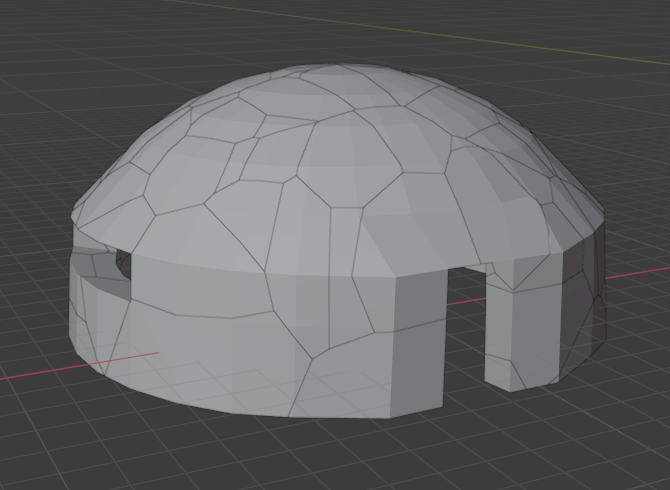

# About
T-72 tank simulation created in Unity game engine. Tank model was created in Blender software.
# Additional info
## Audio
- Tank idle sound and hit explosion sound effect obtained from https://www.zapsplat.com
- Tank shooting sound effect obtained from https://freesound.org/people/qubodup/sounds/239135/
## Particles
 - Particles obtained from https://assetstore.unity.com/packages/essentials/asset-packs/unity-particle-pack-5-x-73777#content
# Screens
## A modelling process of T-72 tank

## The T-72 model in Unity

## The destructable bunker which is the part of scenario

## Main menu

## Caterpillar's shape changing due to a terrain.

# Video link
https://www.youtube.com/watch?v=cdTe33KiSrg
